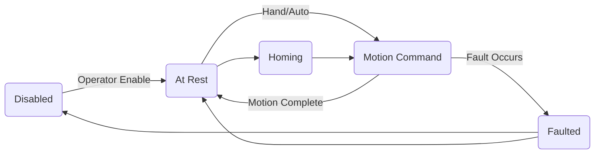

The following series of diagrams have been created to show the control strategy, structure and implementation details in a graphical manner in order to better understand the relationships of the separate  components that comprise the control system. The first diagram is a state diagram showing the different states of the saw throughout it's operation lifecycle. 

These states are listed as:

- Disabled

- At Rest

- Motion Command

- Homing

- Faulted

These are the attainable states of the Saw. In the case of the ***Disabled*** state, it is a state that requires Operator input to transitio out of. The operator input will be in the form of one or both of the following.

- Control Power On by resetting the MCR (Emergency Stop PB)

- Critical Fault reset and clear

While in the ***Disabled*** state, no operation will occur in either mode (*Hand/Auto*), including *Cut Program* editing or *Saw Detail* changes. The Operator Enable action results in a transition to the ***At Rest*** state.

The ***At Rest*** state may be achieved in either *Hand/Auto* modes. In the ***At Rest*** state it is possible to enter or edit *Cut Programs* (*Hand*) and *Saw Details* (*Hand/Auto*). The ***At Rest*** state may or may not be a faulted state in both modes.  From the ***At Rest*** state, while in *Hand* mode, the Operator can transition into the ***Homing*** state or the ***Motion Command*** state. In *Auto* mode, the Operator can transition from the ***At Rest*** state to the ***Motion Command*** state by initiating *Cycle Start*. However, the Operator <u>cannot</u> transition the saw into the ***Homing*** state or enter/edit *Cut Programs* while in *Auto* mode.

The ***Motion Command*** state will occur in both *Hand/Auto* modes. The ***Motion Command*** state is a <u>non-faulted</u> state. 



The start of operations begin with Power Up/Power On by the Operator, which leads to Initialisation of the Separate Control Components (PLC, HMI, Drives, HSC Inputs). Once Initialisation of the Components is complete, Power Up Sequence is complete. This sequence will complete irrespective of faults generated at the time, except those faults that indicate that initialisation fails in one or more components. 

```sequence
Title: Power Up Sequence
Operator->PowerOn:Operator Turns on Power
PowerOn->Initialise:Begin Initialisation
Initialise->Operator:Indicate Power up Complete or Init Fault
```

In the sequence diagram of the Power Up Sequence, the Operator is a hybrid actor that comprises the Operator and PLC control program. Some actions will be automatically handled via programming logic, combined with Operator input. Once the Power Up Sequence is complete the Control Components will be Ready for Control Operations. This is the Faulted/Disabled state of the System, Control Power is not on yet, Homing of Axii is still required and there will be faults the Operator will need to clear. Manual operation becomes available at this state (providing Control Power is on), Automatic is not available. While Control Power being on is not a requisite for this state, it is a pre-requisite for the subsequent state.

```flowchart
title: Commander SK Drive Initialisation
st=>start: Power On Acknowledged initialise Drive
op=>operation: Verify Drive Initialised
cond=>condition: Yes or No?
chkflt=>operation: Check if Fault is Critical
fltsev=>condition: Yes or No
critical=>operation: Announce Critical Fault
e=>end: Initialisation Completed Successfully

st->op->cond
cond(yes)->e
cond(no)->chkflt->fltsev(yes)->critical
cond(no)->chkflt->fltsev(no)->op
```

The flow chart above represents the flow of control while initialising any one of the Axis positioning drives. When the request to initialise arrives, there is a delay before the drive is capable of returning a successful ready state. Therefore, initialisation will retry until successful, providing no critical drive error is found. If a critical fault has occurred, then further initialization is halted until the faulted condition is cleared and acknowledged.
