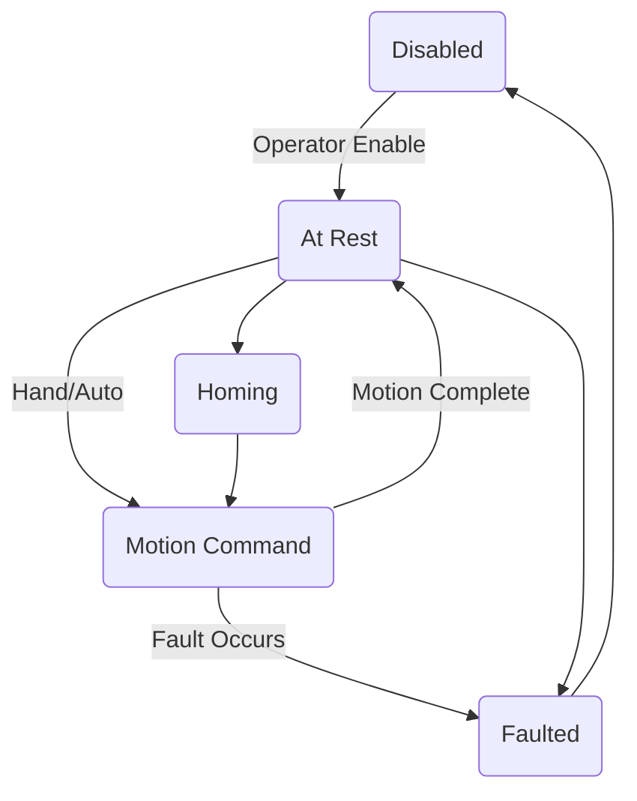
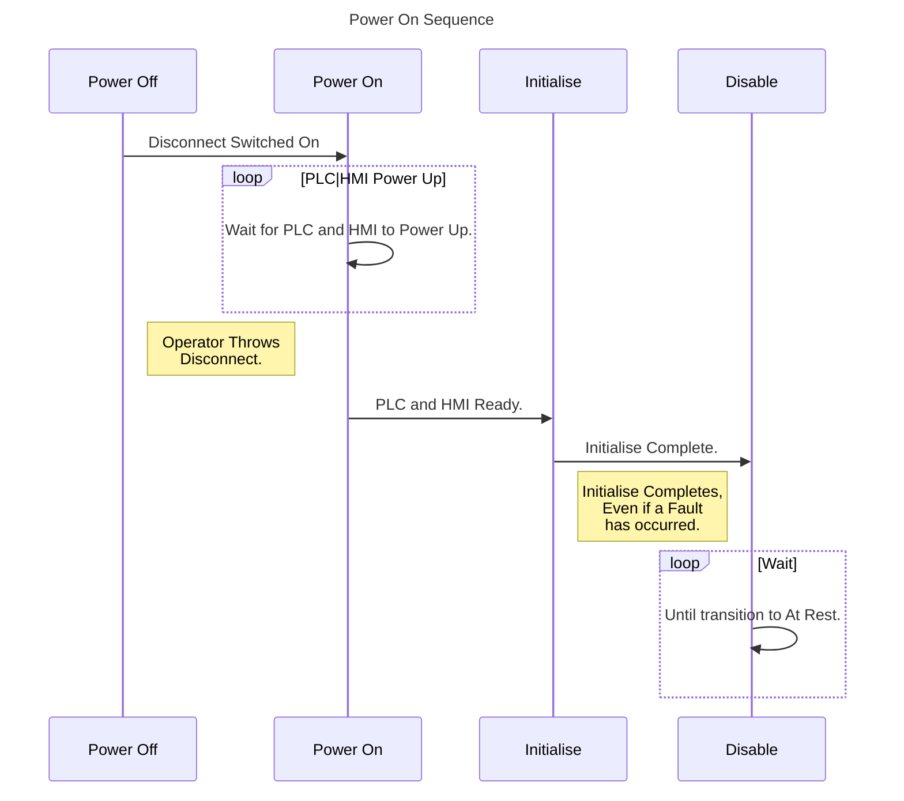
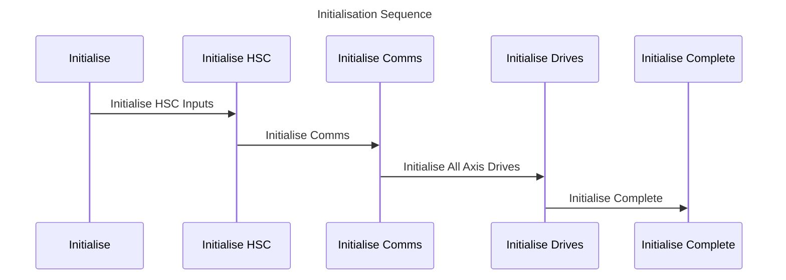

The following series of diagrams have been created to show the control strategy, structure and implementation details in a graphical manner in order to better understand the relationships of the separate  components that comprise the control system. The first diagram is a state diagram showing the different states of the saw throughout it's operation lifecycle. 

These states are listed as:

- Disabled

- At Rest

- Motion Command

- Homing

- Faulted

These are the attainable states of the Saw. In the case of the ***Disabled*** state, it is a state that requires Operator input to transition out of. The operator input will be in the form of one or both of the following.

- Control Power On by resetting the MCR (Emergency Stop PB)

- Critical Fault reset and clear

While in the ***Disabled*** state, no operation will occur in either mode (*Hand/Auto*), including *Cut Program* editing or *Saw Detail* changes. The Operator Enable action results in a transition to the ***At Rest*** state.

The ***At Rest*** state may be achieved in either *Hand/Auto* modes. In the ***At Rest*** state it is possible to enter or edit *Cut Programs* (*Hand*) and *Saw Details* (*Hand/Auto*). A Fault may occur while in the ***At Rest*** state in either *Hand* or *Auto* modes.  From the ***At Rest*** state, while in *Hand* mode, the Operator can transition into the ***Homing*** state or the ***Motion Command*** state. In *Auto* mode, the Operator can transition from the ***At Rest*** state to the ***Motion Command*** state by initiating *Cycle Start*. However, the Operator <u>cannot</u> transition the saw into the ***Homing*** state or enter/edit *Cut Programs* while in *Auto* mode.

The ***Motion Command*** state will occur in both *Hand/Auto* modes. The ***Motion Command*** state is a <u>non-faulted</u> state. During the ***Motion Command*** state, the Operator cannot enter/edit *Cut Program* data, but may enter/edit *Saw Details*. If a *Fault* occurs from within the ***Motion Command*** state, the Saw will transition to the Faulted state. If no Fault occurs during the ***Motion Command*** state by the time motion has completed, the transition will be to the ***At Rest*** state.

The ***Faulted*** state may occur in either *Hand/Auto* modes, and during the ***Motion Command*** or ***At Rest*** states. The *Saw* will transition from the ***Faulted*** state to the ***Disabled*** state once the faulted condition occurs. The *Saw* will transition from the ***Disabled*** state to the ***At Rest*** state, once the faulted condition is acknowledged and cleared. All *Faults* must be <u>acknowledged</u> by the Operator in order to transition out of the ***Faulted*** state.

The start of operations begin with Power Up/Power On by the Operator, which leads to Initialisation of the Separate Control Components (PLC, HMI, Drives, HSC Inputs). Once Initialisation of the Components is complete, Power Up Sequence is complete. This sequence will complete irrespective of faults generated at the time. 

Once the Power Up Sequence is complete the Control Components will be Ready for Control Operations. This is a ***Disabled*** state of the System, Control Power is on, Homing of Axii is still required and there will be faults the Operator will need to clear. Manual operation becomes available at this state with Control Power on, Automatic is not available. 

The Sequence chart above represents the initialisation operations that occur when the request to initialise arrives. If a critical fault has occurred, the saw remains in the ***Disabled*** state until the faulted condition is cleared and acknowledged. The Comms are a short hand for Communications Ports. Since there are control and process critical data transmitted over the communication ports, it is important that they function as expected. The High Speed Counter inputs of the PLC need to be configured for the signals they will interpret from the encoder(s) that are connected to them, so must be initialised at the early stages of Power Up. Once the Comms are initalised,  the drives will be initialised. 

